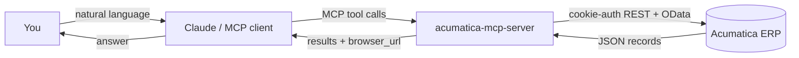
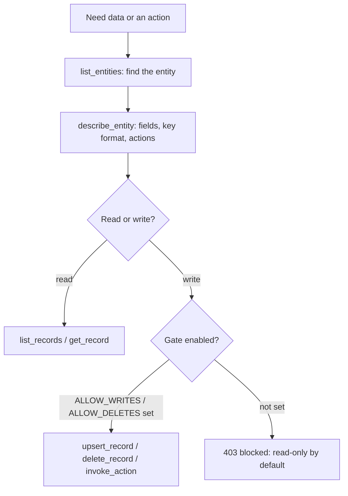
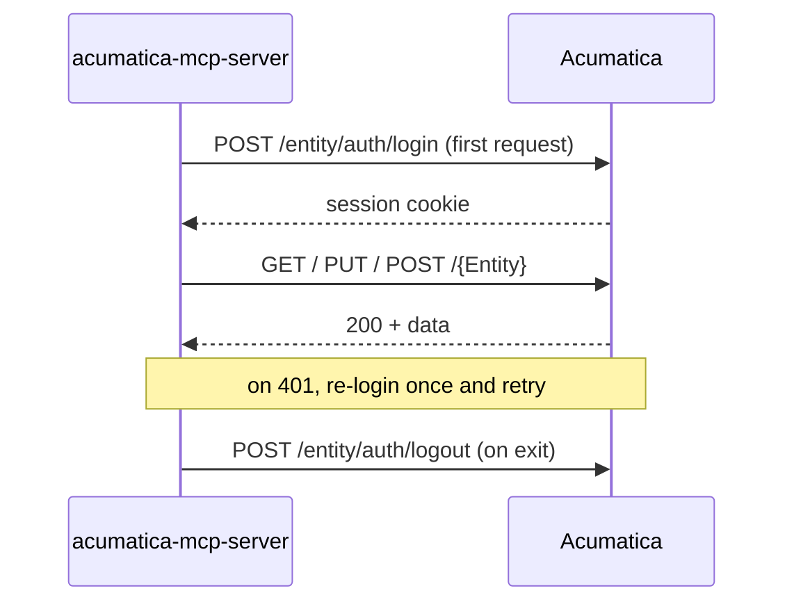

```
                          ____
       o o o             |    |___________________
     o o o o        _____|                        |____
    o o o o        |   A C U M A T I C A   M C P        |
   ~~~~~~~~~~~~~~~~~|              S E R V E R           |
  |================|====================================|
  |  ___    ___    ___    ___    ___    ___    ___   |#|
  | |   |  |   |  |   |  |   |  |   |  |   |  |   |   |#|
  |_|___|__|___|__|___|__|___|__|___|__|___|__|___|__|#|
  (=)==(O)====(O)====(O)====(O)====(O)====(O)====(O)==(O)
     ==>   ==>   ==>   ==>   ==>   ==>   ==>   ==>   ==>
```

# Acumatica MCP Server


A [Model Context Protocol](https://modelcontextprotocol.io) (MCP) server for
**Acumatica ERP**. It lets an MCP client (Claude Desktop, or any MCP-aware agent)
query and act on **any** Acumatica tenant's contract-based REST API through just
**8 generic tools**.

Acumatica's contract API is uniform: every entity (SalesOrder, Bill, Customer,
StockItem, and so on) supports the same `GET / PUT / DELETE` verbs with OData
query parameters, plus `POST /{Entity}/{Action}` for entity-specific actions.
Instead of hand-coding hundreds of endpoints, this server exposes 8 tools that
cover the entire surface (all ~119 entities in a standard tenant), plus a small
catalog that teaches the model each entity's fields, key format, and actions.

> **Status:** Beta. Battle-tested in day-to-day operations against a live
> production Acumatica ERP before being generalized and open-sourced here.

## Table of Contents

- [Features](#features)
- [Architecture](#architecture)
- [The 8 tools](#the-8-tools)
- [How a query flows](#how-a-query-flows)
- [Requirements](#requirements)
- [Installation](#installation)
- [Configuration](#configuration)
- [Register with Claude Desktop](#register-with-claude-desktop)
- [Authentication](#authentication)
- [Write safety (read-only by default)](#write-safety-read-only-by-default)
- [Regenerating the entity catalog](#regenerating-the-entity-catalog)
- [Security notes](#security-notes)
- [Prior art and related projects](#prior-art-and-related-projects)
- [License](#license)
- [Disclaimer](#disclaimer)

## Features

- **Small and legible.** One server file, ~700 lines, three dependencies. You can
  read the whole thing before trusting it with your ERP.
- **Complete coverage.** 8 generic tools reach all ~119 entities of any tenant's
  contract API, no per-entity code.
- **Read-only by default.** Writes and deletes stay disabled until you explicitly
  opt in, so it is safe to point at production while you explore.
- **Portable.** Works against any Acumatica instance with just a service account.
- **Clickable results.** Records come back with a `browser_url` that links
  straight to the record in the Acumatica web UI.
- **Self-correcting queries.** Errors return actionable hints (wrong field name,
  missing mandatory filter, permission gap) instead of raw HTTP 500s.

## Architecture



The server is a thin, stateless translator: MCP tool calls in, Acumatica REST
calls out. All entity knowledge (fields, keys, actions) lives in a data catalog
(`entity_catalog.json`), so the tools stay generic.

## The 8 tools

| Tool | HTTP | What it does |
|------|------|--------------|
| `list_entities` | (local) | List the entities available in the tenant, filterable by substring. |
| `describe_entity` | (local) | **Call this first.** Returns an entity's fields, key format, actions, and expandable sub-collections. |
| `list_records` | `GET /{Entity}` | Query records with OData (`$filter`, `$select`, `$top`, `$expand`, and so on). |
| `get_record` | `GET /{Entity}/{key}` | Fetch a single record by its key. |
| `upsert_record` | `PUT /{Entity}` | Create or update a record. Requires `ACUMATICA_ALLOW_WRITES=1`. |
| `delete_record` | `DELETE /{Entity}/{key}` | Delete a record. Requires `ACUMATICA_ALLOW_DELETES=1`. |
| `invoke_action` | `POST /{Entity}/{Action}` | Run an action (Release, Cancel, Confirm). Requires `ACUMATICA_ALLOW_WRITES=1`. |
| `get_schema` | `GET /{Entity}/$adHocSchema` | Discover user-defined (DAC extension) fields and view names. |

See **[docs/USAGE.md](docs/USAGE.md)** for the field-name, key-format, `$filter`,
and `$custom` rules that make queries reliable.

## How a query flows

The golden rule: **call `describe_entity` first.** Most failures come from
guessing field names or key formats.



## Requirements

- An Acumatica instance with the **contract-based REST API** enabled (the default
  `Default` endpoint, for example version `24.200.001`).
- A **dedicated service / integration account** with the appropriate role(s).
- Python **3.10+**.

## Installation

### Option A: run from a clone (simplest for Claude Desktop)

```bash
git clone https://github.com/yourlastnamesoundslikeatypeofpasta/acumatica-mcp-server.git
cd acumatica-mcp-server
python -m venv .venv
# Windows:      .venv\Scripts\activate
# macOS/Linux:  source .venv/bin/activate
pip install -r requirements.txt
```

### Option B: pip install

```bash
pip install acumatica-mcp-server
```

This installs an `acumatica-mcp-server` console entry point and
`python -m acumatica_mcp.server`.

## Configuration

The server reads its connection settings from environment variables. There are two
ways to supply them, and you only need **one** (you never enter credentials twice):

- **Option A: the MCP client `env` block (recommended).** Put the values in your MCP
  client config (see [Register with Claude Desktop](#register-with-claude-desktop)).
  Nothing is written to disk and no `.env` file is needed.
- **Option B: a `.env` file.** Copy [`.env.example`](.env.example) to `.env` next to
  `server.py` and fill it in. Your MCP client config then only needs the
  `command`/`args`, not the credentials.

```ini
ACUMATICA_BASE_URL=https://your-instance.acumatica.com
ACUMATICA_ENDPOINT_PATH=/entity/Default/24.200.001
ACUMATICA_USERNAME=service_account
ACUMATICA_PASSWORD=your-password
ACUMATICA_COMPANY=YourCompany
```

If you set both, the `env` block (process environment) wins and the `.env` file only
fills in anything it did not set.

## Register with Claude Desktop

Add this to your `claude_desktop_config.json` (full example in
[`docs/claude-desktop-config.example.json`](docs/claude-desktop-config.example.json)).
This is **Option A**: credentials live in the `env` block. If you use a `.env` file
instead (Option B), drop the `ACUMATICA_*` credential keys from `env`:

```json
{
  "mcpServers": {
    "acumatica": {
      "command": "python",
      "args": ["C:/path/to/acumatica-mcp-server/src/acumatica_mcp/server.py"],
      "env": {
        "ACUMATICA_BASE_URL": "https://your-instance.acumatica.com",
        "ACUMATICA_ENDPOINT_PATH": "/entity/Default/24.200.001",
        "ACUMATICA_USERNAME": "service_account",
        "ACUMATICA_PASSWORD": "your-password",
        "ACUMATICA_COMPANY": "YourCompany"
      }
    }
  }
}
```

Restart Claude Desktop, then try: *"List the open sales orders modified in the
last 14 days"* or *"Describe the Bill entity."*

## Authentication

Cookie-based. The server logs in on the first request, holds the session cookie,
transparently re-logs in on a 401, and logs out on exit.



## Write safety (read-only by default)

The three mutating tools are **disabled by default**. Enable them deliberately
via environment variables:

| Variable | Enables |
|----------|---------|
| `ACUMATICA_ALLOW_WRITES=1` | `upsert_record` and `invoke_action` |
| `ACUMATICA_ALLOW_DELETES=1` | `delete_record` |

When a mutating tool is called while disabled, it returns a `403`-style envelope
with a hint telling you which variable to set. No request is sent to Acumatica.

## Regenerating the entity catalog

The bundled `entity_catalog.json` covers standard Acumatica entities. If your
tenant has customizations (custom entities, extension fields), regenerate it from
your tenant's OpenAPI spec:

1. In Acumatica, open your endpoint under **Web Service Endpoints** and export its
   OpenAPI (Swagger) JSON, or `GET {BASE_URL}{ENDPOINT_PATH}/swagger.json`.
2. Rebuild:
   ```bash
   python src/acumatica_mcp/rebuild_catalog.py path/to/your_openapi_spec.json
   ```
3. Restart the server (the catalog is loaded once at startup).

## Security notes

- **Read-only by default.** `upsert_record` and `invoke_action` require
  `ACUMATICA_ALLOW_WRITES=1`; `delete_record` requires `ACUMATICA_ALLOW_DELETES=1`.
  Enable them only when you mean to, ideally on a sandbox tenant.
- **Use a dedicated service account** scoped to only the entities/roles you need,
  never a real person's login. A read-only role in Acumatica is a good second
  layer of defense.
- `.env` is git-ignored. Keep credentials out of version control; prefer passing
  them through your MCP client's `env` block.

## Prior art and related projects

This is not the first Acumatica-to-MCP or Acumatica-to-AI project. If this one
does not fit your needs, look at these:

- [grp-mcp](https://github.com/Arvindh95Censof/grp-mcp): a far more capable MCP
  server with full CRUD, four client planes, and headless ERP setup.
- [MCP4Acumatica](https://github.com/hallboys/MCP4Acumatica): a remote MCP server
  (Cloudflare Workers) with per-user OAuth and role-based, read-only access.
- [easy-acumatica](https://github.com/Nioron07/Easy-Acumatica): a mature Python
  REST SDK (not MCP) with dynamic model generation.
- [CData Acumatica MCP Server](https://github.com/CDataSoftware/acumatica-mcp-server-by-cdata):
  a read-only MCP backed by the CData JDBC driver.

This server's angle is deliberate minimalism: a small, dependency-light,
self-hostable stdio server you can read top to bottom in one sitting, that works
against any tenant with nothing but a service account.

## License

[MIT](LICENSE) (c) Christian Zagazeta

## Disclaimer

Not affiliated with or endorsed by Acumatica, Inc. "Acumatica" is a trademark of
its respective owner. Use at your own risk against your own tenants.
